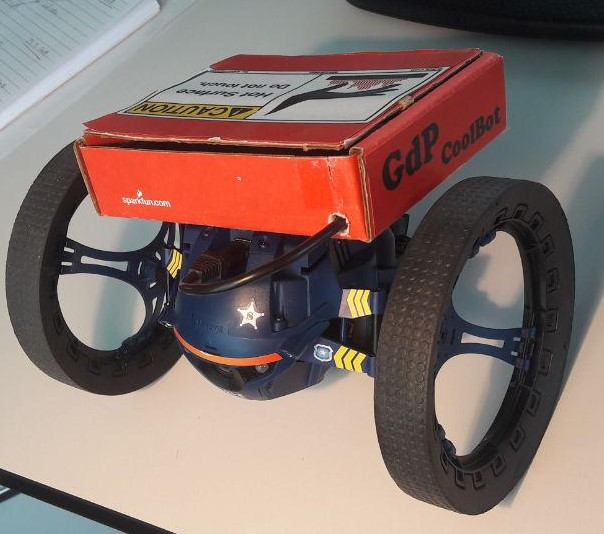
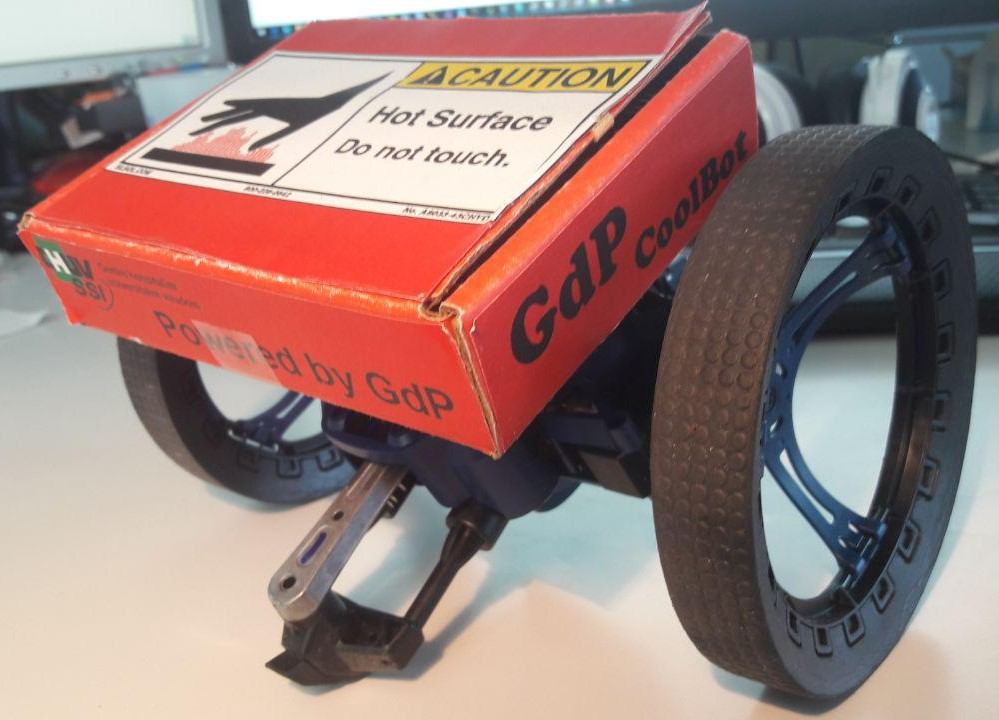
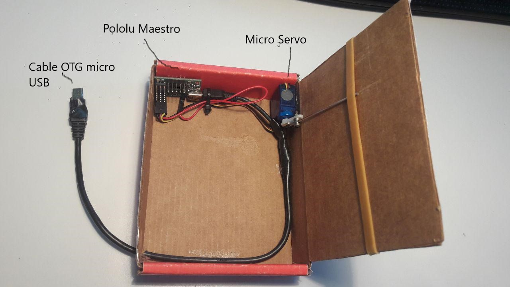

# Jumping-Box

Add a cool designed Box on the top of your Parrot Jumping Drone that you can open and close remotely.






The heart of this box is a [Pololu Maestro servo controller](https://www.pololu.com/product/1351)

## Diagram :
                   

	
## How it's Work

On the Drone you have a `MaestroServer.c` which listen on 4567 udp port for command
On the controller you can send `open` or `close` command to control the box

## Build and Installation

 - Cross Compile `MaestroServer.c` for arm v5.1 with
   
   `arm-linux-gnueabi-gcc -Wall --static -O2 -marm -march=armv5 MaestroServer.c -o MaestroServer -lm`
 - transfer the executable to your drone
 - Make script to load module 
 
   `insmod /lib/modules/2.6.36/kernel/drivers/usb/class/cdc-acm.ko` on Sumo
   
   `insmod /lib\modules\2.6.36-102961-gf9f11f3\kernel\drivers\usb/class/cdc-acm.ko` on Diesel
 - and run MaestroServer executable
 
## Utilisation

 - Use my LibSumo.Net library and call `Controller.OpenBox()` or `Controller.CloseBox()`
 - or Use Parrot SDK and implement your code to transmit command to drone on this base:
 
 ```c#
    Socket sock = new Socket(AddressFamily.InterNetwork, SocketType.Dgram, ProtocolType.Udp);
    IPAddress serverAddr = IPAddress.Parse("192.168.2.1");
    IPEndPoint endPoint = new IPEndPoint(serverAddr, 4567);    
    byte[] send_buffer = Encoding.ASCII.GetBytes("open");
    sock.SendTo(send_buffer, endPoint);
```
Notes : 
 - Be sur you use small servo which have a minimum power consumption.
